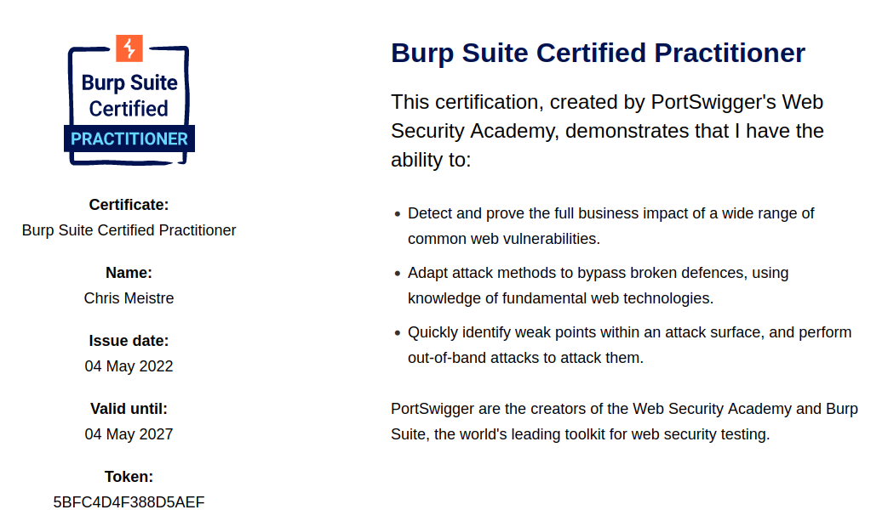
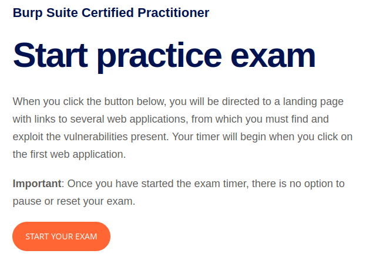

## Burp Suite Certified Practitioner Certification

I was able to recently complete the exam that is required to obtain this certification.  

After having obtained my OSWE (Offensive Security Web Expert) certification from Offensive Security a few months ago and considering that I've been a web application developer for many many years, I was optimistic that this exam would be a piece of cake...

https://portswigger.net/web-security/e/c/5bfc4d4f388d5aef

This excerpt is taking from PortSwigger's website, to describe what this certification is all about:  

> By becoming a Burp Suite Certified Practitioner, you will be able to demonstrate your web security testing knowledge and Burp Suite skills to the world. This certification will prove to peers, colleagues, and employers, that you have the ability to:
> 
>- Detect and prove the full business impact of a wide range of common web vulnerabilities - such as XSS, SQLi, OWASP Top 10 and HTTP Request Smuggling.
> - Adapt your attack methods to bypass broken defenses, using your knowledge of fundamental web technologies like HTTP, HTML, and encodings.
> - Quickly identify weak points within an attack surface, and perform out-of-band attacks to attack them, using manual tools to aid exploitation.

It was for the above reason that I wanted to get this certification when it was initially announced.  I enjoy web application penetration testing, so I grab at anything that I can do that furthers my knowledge on this subject.

## Learning material

Even before their certification being available, PortSwigger has always had a very good learning lab for web application exploits.  

Have a look at https://portswigger.net/web-security/all-labs, for basically everything you could think of that relates to hacking web applications.

For each lab you have access to an instance of the application with the vulnerability that you want to learn about.  There is also a guide on how to perform the exploit, as well as solutions provided by the community.

To be able to successfully complete the exam, they recommend that you at least complete all the Apprentice and Practitioner rated labs.

They also have a practice exam that should simulate a similar environment than you should receive for your actual exam.

I got a bit impatient, and only completed 26/50 of the Apprentice rated labs, and 42/130 of the Practitioner labs before I attempted the practice exam.  My first tip would be, don't get impatient and rather spend the time to complete the labs.

It's not only about learning the techniques, but you need to learn in what format these vulnerabilities might be found in the applications you need to compromise during the exam.  The methodology that you are following is that of a blackbox engagement, which means you do not have access to the source code.  So you have to find the vulnerabilities by manual inspection, or using Burp Suite tools.  Knowing what you've found during the labs, where you found them and in what format, definitely helps you find them easier in the exam.

You also need to understand how to use PortSwigger's exploit server, which is where you will develop payloads to deliver to your victims.  

The last caveat is that you need to use Burp Suite Professional.  I believe you can get a 30 day free trial from PortSwigger.

## Practice exam

The practice exam gives you one application that you must fully compromise within a 2 hour timeframe.  I'm not sure if this changed since I did my practice exam, because I was sure I had more time when I did it.  But as of writing this post, there is 2 hours.

The application you have to compromise, basically have the following steps or phases of vulnerabilties you must find and exploit:

1.  Obtain initial access to a user account.  This is normally something like XSS that you'll use to steal cookies.  
2.  Escalated privileges to that of an administrator user.  This could be something like SQLi to dump the administrator password or session manipulation.
3.  The final step is to read a secret file on the server, by using vulnerabilities such as LFI or SSRF.

## The exam details

The exam follows the exact same format (3 phases) as the practice exam.  The difference is that you need to compromise two different application, within a 4 hour timeframe.

PortSwigger makes use of Examity in order to perform identification verification before your exam starts.  This works nicely because this means you don't have to schedule your exam ahead of time.  You simply purchase an attempt, and can start it anytime by clicking on a button and starting the procedure.

What annoyed me though was that it is stipulated that you need to use Chrome and a Windows machine to perform the exam.  This meant I had to set up a separate laptop with Windows.

What annoyed me even more was as soon as you're done with the identification verification (take a photo of your face and your ID card with the webcam), you can close the Examity software, and carry on with the exam.  I'm not sure if I follow what the whole thing about verifying the user's identity is about, if you're just switching off the webcam after the verification process anyways.  Who says the same person that showed his face, is going to be performing the exam?  It just leaves a whole lot of possibility for cheating, and in my mind will do damage to the reputation of this certification.

## My first attempt

During November 2021, there was a "Black Friday" special, where you could buy exam attempts for $9.  I can't remember what the normal price was back then, but currently the normal price is $99.  I didn't think of it back then, but it would probably have been a better investment if I applied for multiple attempts.  To do this would've required a hack of sorts, as you are only able to have one active attempt register to your account at any given time.  In order to purchase multiple exam attempts, you would have to register multiple accounts.

Before I attempted it, I set myself a goal of going through all the PortSwigger labs first.  With work, and doing other courses in the meanwhile, I couldn't quite keep to that goal.  I grew a bit impatient, and decided on a whim that I'll just sit down and attempt the exam.

I had to get a laptop setup with Windows 10, which was a whole mission on it's own due to me formatting and running Linux on it since I got it about 3 years ago.  I didn't have any of the recovery discs that were required.  

With a newborn in the house, busy with other courses and having a full time job, it's a bit difficult to find time to attempt the exam.  I finally saw a gap that I would have from 20:30 until 00:30 one evening.

As I mentioned earlier, you can attempt this exam at anytime by the click of a button, so that's quite a nice feature.

I was able to fully compromise the first application in about 1.5 hours, and then got stuck on 2/3 of the second application.  I realised I had made a mistake to attempt this without spending more time in the labs.  I had to spend time to figure out how the exploit server works, how do delivery the payload to the victim, how exploits like XSS would get "executed", etc.  

With 10 minutes to go I found the last vulnerability, but while trying to figure out the correct payload to use, my time ran out.  I estimated that I needed another 10 minutes, and I would've completed it.  

#### What did I learn?

- I should've spent more time understanding how the exploit server works

## My second attempt

The very next day, I purchased another attempt.  It took another day or so for me to find time again to sit down to attempt it.  I had to set aside 20:30 to 00:30 again to attempt it.

I found the initial vulnerability in the first application within a few minutes, and had what I thought was a working payload.  Using PortSwigger's exploit server, you are able to test the payload.  When I tested it against myself, the payload was working as expected, but I couldn't get the victim to trigger it.  I tried another 15-20minutes, and decided to attempt application 2 and come back to this later.

I spent around 40 minutes to fully compromise application 2, until I came back to application 1.  After another 30 minutes of poking around, I decided to send off an email to the support team, to see if they can just check that the script that is supposed to simulate the victim's actions are indeed running.

I received an auto response stating that I will receive a response within 48 hours, and to take note I have emailed them after hours.  It's quite frustrating realising there is actually no actual live exam support if you need it.  

I gave up on this attempt, with the hope that I'm right in that there is something wrong with the exam environment.

Later the next day I got an email stating I was granted another exam attempt, at no charge.  The support team didn't confirm that there was an issue, or provide any further explanation.

#### What did I learn?

- Trust your instincts.  I've done enough labs and CTF-like machines to have a good indication of when something should be working, but it's not.

## My third attempt

At this point I was already frustrated with this whole process.  I set aside another 4 hours in the middle of the night, to go an attempt this for the 3rd time.

I was able to get to the last step of the first application, within around 30 minutes.  But I got stuck again.  I found the vulnerability, but again something didn't appear to the triggering properly.

I left the first application, and completed the second application in about 25 minutes.  

I spent the rest of the time attempting to get the last step of the first application completed, but because I had previously had an exam environment that wasn't working, and I had the suspicion that the same was happening, I just got more frustrated.

I sent off an email again, but this time days when past without a response.

## My fourth and final attempt

Out of frustration from not hearing anything back, and wanting to get this certification done before a looming influx of work, I just decided to buy another exam attempt.

This time, within around 55 minutes, I had compromised both of the applications, and had done enough to pass the exam.

## Some interesting observations

- During the 4 attempts, it appeared that I got a unique combination of applications each time
- There is no support while you are writing the exam
- There is no proctoring, even though when I initially read the information about the exam it sounded like it would be proctored
- Passing the exam relies heavily on understand the custom exploit server and how to use it
- If you're attempting the exams, do yourself a favor and go through all the labs first
  

## Final thoughts

I am glad I have this certification, because I believe it adds a feather in the cap of any web application penetration tester and/or auditor.  It's not just about use the Burp Suite tool, but it is also about understanding the web application architecture and vulnerabilities properly.

I understand that this is a relatively new certification, and I suppose they are trying to work out kinks in the processes.  It would just be nice to know that there is support available during the exam, and that issues that have been picked up during the exam have been rectified in a permanent manner.